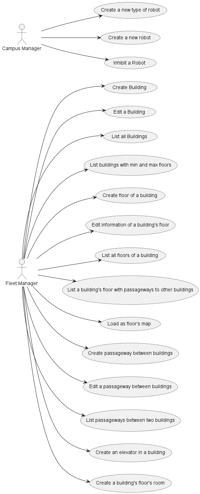

## Contents
- [Architecture Background](#architecture-background)
	- [Problem Background](#problem-background)
		- [System Overview](#system-overview)
		- [Context](#context)
		- [Driving Requirements](#driving-requirements)
			- [Functional requirements](#functional-requirements)
			- [Quality attributes](#quality-attributes)
				- [Funcionalidade](#funcionalidade)
				- [Usabilidade](#usabilidade)
				- [Confiabilidade (Reliability)](#confiabilidade-reliability)
				- [Desempenho (Performance)](#desempenho-performance)
				- [Suportabilidade](#suportabilidade)
				- [Design constraints](#design-constraints)
				- [Implementation constraints](#implementation-constraints)
				- [Interface constraints](#interface-constraints)
				- [Physical constraints](#physical-constraints)
	- [Solution Background](#solution-background)
		- [Architectural Approaches](#architectural-approaches)
		- [Analysis Results](#analysis-results)
		- [Mapping Requirements to Architecture](#mapping-requirements-to-architecture)

# Architecture Background
>The Software Architecture for the RobDroneGo system  is designed as a prototype to address three 
different modules: 
>1. Device Management
>2. Task Request Management
>3. Planning and Execution of a Task
>
>To implement the modules referred to above, this system follows the Onion Architecture, as requested.
>The chosen architecture ensures that the system follows the rationale, which includes:
>* Scalability: the system must be able to support growth.
>* Maintainability: maintenance must be simplified to ensure that ongoing operations and features aren't compromised
>
>Since the Onion Architecture pattern has been chosen for this system, the developed application is separated
into 4 fundamental concentric layers:
> * Core Domain Layer: represents the business and behavior objects. It holds all application domain objects.
> * Repository Layer: consists of the data access pattern by typically adding interfaces that communicate with the 
database providing object saving and retrieving behaviour.
> * Services Layer: used to communicate between repository and UI layers.
> * UI Layer: keeps peripheral concerns like UI and tests, it has not been implemented as for the first sprint of the project.

  
## Problem Background
>The sub-parts of this section explain the constraints that provided the significant influence over the architecture.
>The architecture chosen was adopted purely by teachers request

### System Overview
> RobDroneGo consists of a robot and drone task monitoring system, developed as the prototype which could evolve to 
support various users requesting different tasks for the devices, such as:
> 1. Object delivery
> 2. Hallways and campus video vigilance
> 3. Hallway cleaning
> 4. Window cleaning
>
> The system is prepared to support users with different roles:
>* System Administrator - manages users and respective permissions
>* Fleet manager - manages robots and drone data and task types
>* Campus manager - manages path and map data
>* User (student, teacher, employee) - asks for task execution

### Context
> The architecture used for the development of the system provides the possibility to work in different modules without 
affecting directly the already functional/existent ones. 
> It is also important for the creation of diagrams of level 1, 2 and 3.
> 
> The isolation of layers and how they can communicate with each other without compromising either helps with system scalability
and maintainability:
> 
> Maintainability: 
> 
> * **Clean separation** between the core business logic and the infrastructure
> * **Testability** is easily automated
> * Easily **Adapted** due to the low coupling between classes
> * Easily **Maintained and Understood** code by following the right principles for coding and designing 
>
> Scalability:
> 
> * **Modular structure** - each layer has a specific purpose
> * **Isolation of concerns** - changes made within outer layers do not compromise the core domain layer
> * **Dependency Inversion** - the application service behaviour is controlled by the upper layers

### Driving Requirements
> This section lists the functional requirements, quality attributes and design constraints. It may point to a separate requirements document.

#### Functional requirements

>* Creation of types of Robots
>* Creation of Robots
>* Inhibiting Robots
>* Creation of Buildings
>* Editing of a Specific Building
>* Listing all Buildings
>* Creation of a building's Floors
>* Editing a specific Floor
>* Listing all floors of a Building
>* Listing a building's floors with passageways to other buildings
>* Load a floor's Map
>* Creation of a passageway between buildings
>* Editing a specific passageway
>* Listing passageways between two buildings
>* Create a building's elevator
>* Create a building's floor's room
>* 

#### Quality attributes
Quality attributes are categorized and systematized following the [FURPS+](https://pt.wikipedia.org/wiki/FURPS) model.

##### Functionality
1. Each system can only access data relevant to it.
2. The integrity of the information that systems access must be audited and verified.
3. In view of the principles of "need to know" and "need to know," all information must be protected from unauthorized access. In other words, the principle of minimizing access to what is essential for each user/application, creating tunnels for information transfer, assessing data and application integrity, and encrypting/minimizing data.
4. It is essential to pay special attention to privacy and data protection in accordance with the General Data Protection Regulation (GDPR). Therefore, the system must comply with current legislation and, in particular, provide legal information and inform the user during registration, as well as allow access to and deletion of their account under legally permissible conditions.
##### Usability

5. Within the scope of the current project, user administration can be done directly in the database without the need for a user management module.

##### Reliability
n/a

##### Performance
n/a

##### Supportability
6. (To be completed)

##### Design constraints
7. (To be completed)

##### Implementation constraints
8. (To be completed)

##### Interface constraints
9. (To be completed)

##### Physical constraints
10. (To be completed)

## Solution Background
> The sub-parts of this section provide a description of why the architecture is the way that it is, and a convincing argument that the architecture is the right one to satisfy the behavioral and quality attribute goals levied upon it.

(To be completed)

### Architectural Approaches
> This section provides a rationale for the major design decisions embodied by the software architecture. It describes any design approaches applied to the software architecture, including the use of architectural styles or design patterns, when the scope of those approaches transcends any single architectural view. The section also provides a rationale for the selection of those approaches. It also describes any significant alternatives that were seriously considered and why they were ultimately rejected. The section describes any relevant COTS issues, including any associated trade studies.
> * Core Domain Layer: Core, DataSchema, Domain, Persistence
> * Repository Layer: Repos
> * Services Layer: Services, Controllers
> * UI Layer: not applied for the first sprint.

### Analysis Results
> This section describes the results of any quantitative or qualitative analyses that have been performed that provide evidence that the software architecture is fit for purpose. If an Architecture Tradeoff Analysis Method evaluation has been performed, it is included in the analysis sections of its final report. This section refers to the results of any other relevant trade studies, quantitative modeling, or other analysis results.

There are currently no analysis or evaluation results available. Qualitative studies on the adopted styles/patterns (particularly Onion in MDR and MDV, as well as Dependency Injection in the UI) empirically suggest that the software's maintainability, scalability, and testability are high, while also enabling the achievement of the desired functionalities.

### Mapping Requirements to Architecture
> This section describes the requirements (original or derived) addressed by the software architecture, with a short statement about where in the architecture each requirement is addressed.

TBD