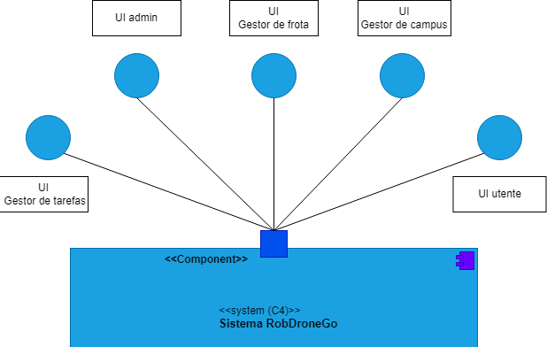
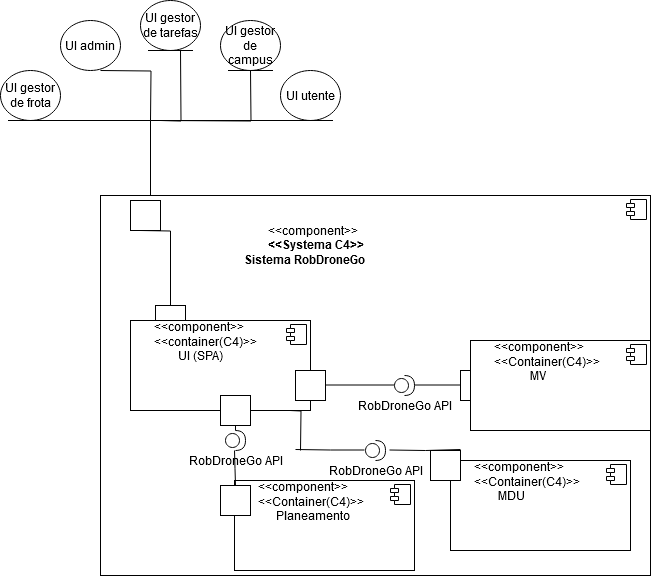
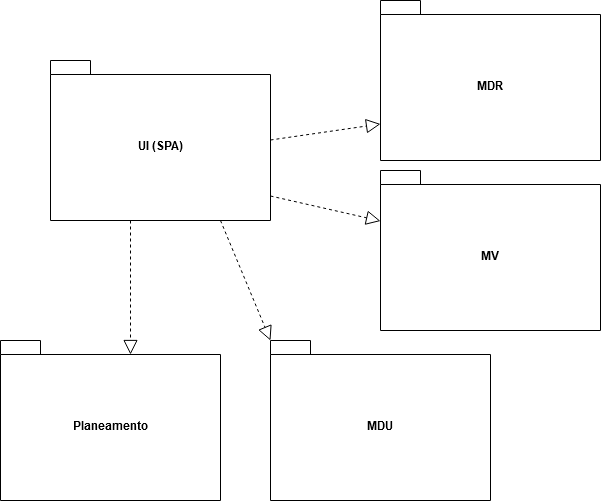
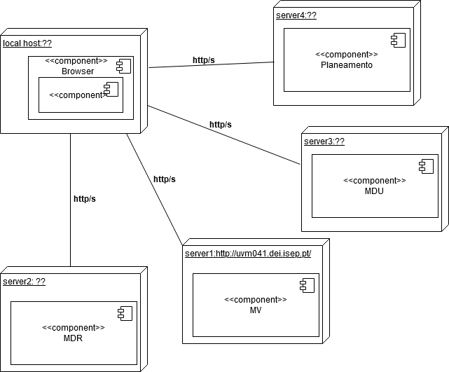

	## Contents
- [Views](#views)
	- [Introduction](#introduction)
	- [Nível 1](#nível-1)
		- [Vista Lógica](#vista-lógica)
		- [Vista de Processos](#vista-de-processos)
			- [SSD US1](#ssd-us1)
			- [SSD US2](#ssd-us2)
			- [(outros SSD arquiteturalmente relevantes)](#outros-ssd-arquiteturalmente-relevantes)
	- [Nível 2](#nível-2)
		- [Vista Lógica](#vista-lógica-1)
		- [Vista de Processos](#vista-de-processos-1)
			- [SSD US13 (Porquê esta US?)](#ssd-us13-porquê-esta-us)
			- [(outros SSD arquiteturalmente relevantes)](#outros-ssd-arquiteturalmente-relevantes-1)
		- [Vista de Implementação](#vista-de-implementação)
		- [Vista Física](#vista-física)
	- [Nível 3 (MDR)](#nível-3-mdr)
		- [Vista Lógica](#vista-lógica-2)
		- [Vista de Processos](#vista-de-processos-2)
			- [SD US01](#sd-us01)
			- [(outros SSD arquiteturalmente relevantes)](#outros-ssd-arquiteturalmente-relevantes-2)
		- [Vista de Implementação](#vista-de-implementação-1)
		- [Vista Física](#vista-física-1)
	- [Nível 3 (UI)](#nível-3-ui)
		- [Vista Lógica](#vista-lógica-3)
		- [Vista de Processos](#vista-de-processos-3)
		- [Vista de Implementação](#vista-de-implementação-2)
		- [Vista Física](#vista-física-2)
	- [Nível 3 (MDV)](#nível-3-mdv)
		- [Vista Lógica](#vista-lógica-4)
		- [Vista de Processos](#vista-de-processos-4)
		- [Vista de Implementação](#vista-de-implementação-3)
		- [Vista Física](#vista-física-3)
	- [Nível 3 (Planeamento)](#nível-3-planeamento)
		- [Vista Lógica](#vista-lógica-5)
		- [Vista de Processos](#vista-de-processos-5)
		- [Vista de Implementação](#vista-de-implementação-4)
		- [Vista Física](#vista-física-4)

# Views

## Introduction
The combination of two architectural representation models will be adopted: C4 and 4+1.

The 4+1 View Model [[Krutchen-1995]](References.md#Kruchten-1995) proposes the description of the system through 
complementary views, allowing the analysis of the requirements of various software stakeholders separately, such as users, system administrators, project managers, architects, and programmers. The views are defined as follows:

- Logical View: Concerned with software aspects aimed at addressing business challenges.
- Process View: Concerned with the flow of processes or interactions in the system.
- Development View: Concerned with the organization of software in its development environment.
- Physical View: Concerned with the mapping of various software components to hardware, i.e., where the software is executed.
- Scenario View: Concerned with associating business processes with actors capable of triggering them.

The C4 Model [[Brown-2020]](References.md#Brown-2020) [[C4-2020]](References.md#C4-2020) advocates describing software through four levels of abstraction: system, container, component, and code. Each level adopts a finer granularity than the preceding level, providing access to more detail of a smaller part of the system. These levels can be compared to maps; for example, the system view corresponds to the globe, the container view corresponds to the map of each continent, the component view corresponds to the map of each country, and the code view corresponds to the map of roads and neighborhoods within each city. Different levels allow different stories to be told to different audiences.

The levels are defined as follows:
- Level 1: Description (context) of the system as a whole.
- Level 2: Description of system containers.
- Level 3: Description of components within containers.
- Level 4: Description of the code or smaller parts of components (and, therefore, will not be addressed in this DAS/SAD).

It can be said that these two models expand along different axes, with the C4 Model presenting the system with different levels of detail, and the 4+1 View Model presenting the system from different perspectives. By combining these two models, it becomes possible to represent the system from various perspectives, each with varying levels of detail.

To visually model/represent both what has been implemented and the ideas and alternatives considered, the Unified Modeling Language (UML) [[UML-2020]](References.md#UML-2020) [[UMLDiagrams-2020]](References.md#UMLDiagrams-2020) is used.
## Level 1
### Logical View

### Process View

**[SSD US150](diagramas/nivel1/UC150.md)**
**[SSD US160](diagramas/nivel1/UC160.md)**
**[SSD US170](diagramas/nivel1/UC170.md)**
**[SSD US190](diagramas/nivel1/UC190.md)**
**[SSD US200](diagramas/nivel1/UC200.md)**
**[SSD US210](diagramas/nivel1/UC210.md)**
**[SSD US240](diagramas/nivel1/UC240.md)**
**[SSD US270](diagramas/nivel1/UC270.md)**
**[SSD US350](diagramas/nivel1/UC350.md)**
**[SSD US370](diagramas/nivel1/UC370.md)**

#### (other architectural relevant diagrams)

## Level 2
### Logical View

### Process View

**[SSD US150](diagramas/nivel2/UC150.md)**
**[SSD US160](diagramas/nivel2/UC160.md)**
**[SSD US170](diagramas/nivel2/UC170.md)**
**[SSD US190](diagramas/nivel2/UC190.md)**
**[SSD US200](diagramas/nivel2/UC200.md)**
**[SSD US210](diagramas/nivel2/UC210.md)**
**[SSD US240](diagramas/nivel2/UC240.md)**
**[SSD US270](diagramas/nivel2/UC270.md)**
**[SSD US350](diagramas/nivel2/UC350.md)**
**[SSD US370](diagramas/nivel2/UC370.md)**

#### (other architectural relevant diagrams)
[...]

### Implementation View

### Physical View

A very simplified proposal. 

In fact, non-functional requirements must be taken into account ["Physical Contraints"](Background.md#Physical_Constraints).

## Level 3 (RobDroneGo)

### Logical View

View based in a concentric layered architecture (Onion):

### Vista de Processos

**[SSD US150](diagramas/nivel3/UC150.md)**
**[SSD US160](diagramas/nivel3/UC160.md)**
**[SSD US170](diagramas/nivel3/UC170.md)**
**[SSD US190](diagramas/nivel3/UC190.md)**
**[SSD US200](diagramas/nivel3/UC200.md)**
**[SSD US210](diagramas/nivel3/UC210.md)**
**[SSD US240](diagramas/nivel3/UC240.md)**
**[SSD US270](diagramas/nivel3/UC270.md)**
**[SSD US350](diagramas/nivel3/UC350.md)**
**[SSD US370](diagramas/nivel3/UC370.md)**

#### (other architectural relevant diagrams)
[...]

### Implementatoin View

### Physical View

There is no need to represent it for now.

## Level 3 (UI)
Not implemented as of the current sprint.
### Logical View
TBD

### Process View
TBD

### Implementation View
TBD

### Physical View
TBD
